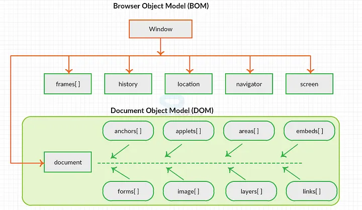
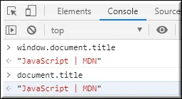
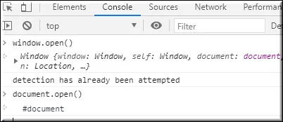

# 1. Write a blog on the difference between document and window objects

## Browser Object Model (BOM)

The Browser Object Model contains objects that represent the current browser window or tab. The topmost object in the BOM is the window object representing the window or tab or an iframe sometimes. Window object has properties like browser history, location and the device’s screen etc. In case of multi tab browser, a window object represents a single tab, but some of its properties like innerHeight, innerWidth and methods like resizeTo() will affect the whole browser window.

## Document Object Model

When a web page is loaded, the browser creates a Document Object Model of the page. The document object represents the whole html document as a tree of Objects(HTML, HEAD, BODY, and other HTML tags). It is the root element that represents the html document.

Figure 1 : Hierarchy of Window and Document object using BOM and DOM

**Window object :** It is the top most object and outermost element of the object hierarchy as shown in Figure 1.

**Document object :** Each HTML document that gets loaded into a window becomes a document object. The document contains the contents of the page. Using document object, JavaScript can modify, add and delete the HTML elements, attributes CSS styles in the page

The `window object` represents a window/tab containing a DOM document where as `document object` is property of `window object` that points to the DOM document loaded in that window.

You can access a document object either using window.document property or using document object directly as window is global object. In the below example, title is the property of document object.

The other major difference is that both window object and document object have properties and methods. Few method names are same in both objects but with different behavior. In the below example window.open() opens a new tab or window and document.open() creates a blank document within the window.

| Document                                                                      | Window                                                                |
| ----------------------------------------------------------------------------- | --------------------------------------------------------------------- |
| It represents the document loaded inside the window or browser.               | It represents the browser window in which you are seeing the content. |
| The properties related to it are stored in the document object.               | The properties related to it are stored in the window object.         |
| It is loaded after the loading window because the window contains a document. | It is loaded before the document because window container document.   |
| It is the root element of the document object model.                          | The window is the global element for all objects, functions, etc.     |
| It is an object of window.                                                    | It is an object of the browser.                                       |
| We can not access windows objects properties inside the document.             | We can access document object properties inside the window.           |
| logically: document:{ properties}                                             | logically: window:{document:{properties}}                             |
| Example: document.title will return the title of the document                 | Example: window.document.title will return the title of the document. |
